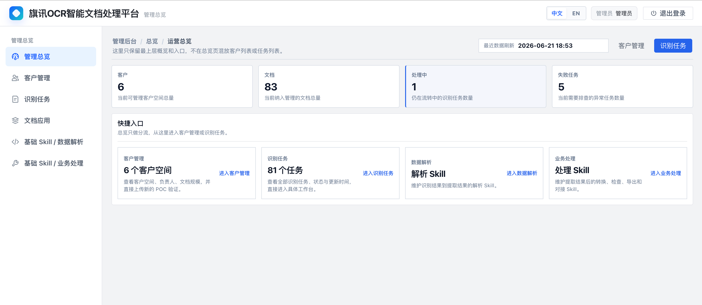
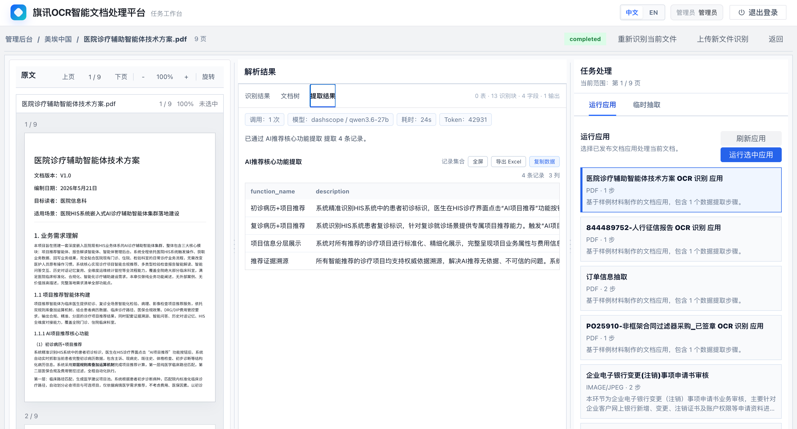
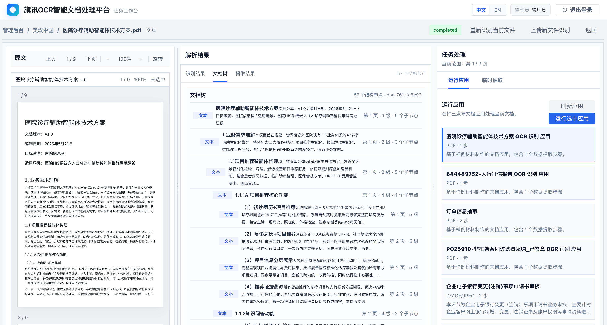
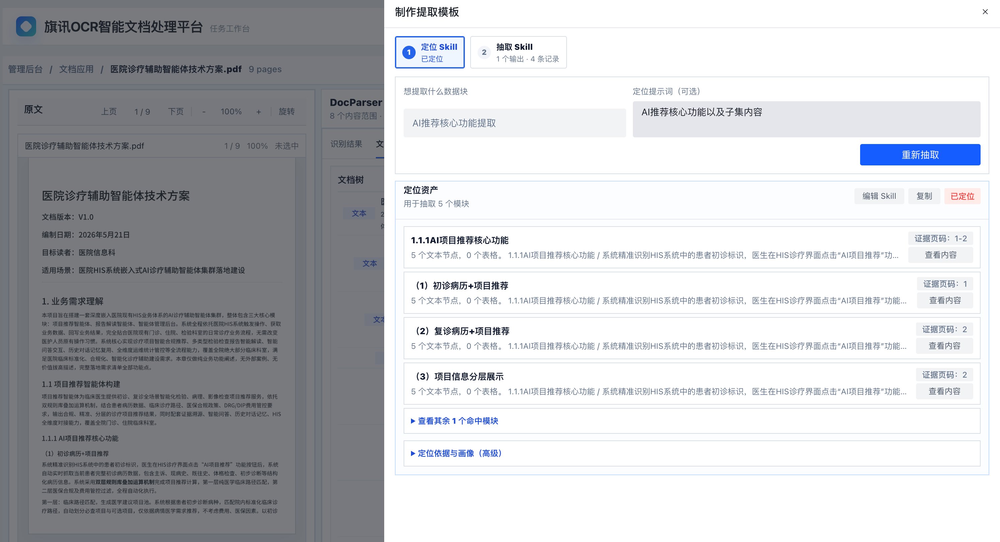
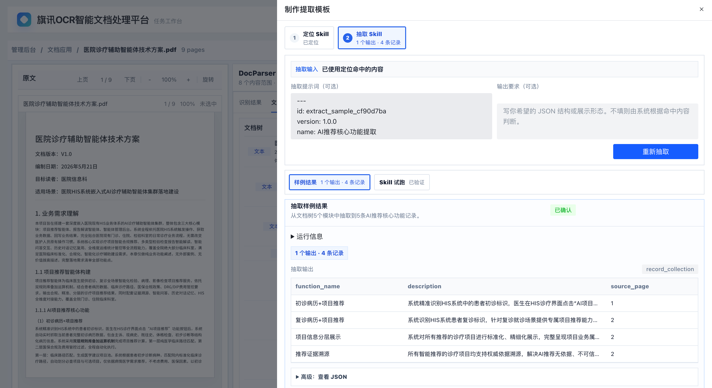

# TechFlag IDP Community

[中文 README](README.zh-CN.md) · [User Manual](docs/user-manual.md) · [中文使用手册](docs/user-manual.zh-CN.md) · [Gitee Mirror](https://gitee.com/techflag/idp)

Build document AI workflows from real files: OCR, document trees, evidence-grounded extraction, and reusable document applications in one local-first workbench.


## Overview

TechFlag IDP Community is an open-source intelligent document processing workbench for developers, document-AI builders, and teams exploring LLM-based extraction.

It gives you a complete local loop:

1. Upload a PDF or image.
2. Parse it with OCR and layout recognition.
3. Inspect the document tree, OCR blocks, tables, and evidence.
4. Run AI extraction against the selected evidence.
5. Turn repeatable extraction logic into a basic reusable document workflow.

The community edition is designed to be easy to start, easy to read, and safe to extend. It uses SQLite and local object storage by default, while letting you bring your own OCR and LLM providers when you want real parsing and extraction.

## News

- **2026-06-21**: First public community snapshot, with English/Chinese UI, SQLite bootstrap, MinerU provider support, and GitHub/Gitee release packaging.

## What You Can Build

| Use case | What the community edition provides |
|---|---|
| Document review | Upload files, inspect OCR content, tables, pages, and document tree structure. |
| Evidence-grounded extraction | Extract structured JSON from located document evidence instead of asking the model to read the whole file blindly. |
| Temporary extraction | Type what you want to extract; the system locates relevant content and runs one-time extraction. |
| Basic document applications | Save repeatable extraction steps into a lightweight workflow for similar documents. |
| Local evaluation | Run with SQLite and local storage before introducing external infrastructure. |

## How It Works

### 1. Parse Documents

MinerU is the default OCR and document parsing engine. TechFlag IDP stores the original file, sends a reachable file URL to MinerU when configured, and normalizes the returned text, tables, blocks, and layout metadata.

### 2. Build Reviewable Evidence

The workbench reconstructs a document review view from parsed content: page text, tables, OCR blocks, document tree nodes, and evidence references. The goal is to make model input visible and auditable.

### 3. Locate Before Extracting

Extraction is not just "send everything to an LLM." The system first narrows the target content by page, selected content, or document tree evidence, then runs structured extraction against that evidence.

### 4. Reuse Successful Workflows

When an extraction target becomes repeatable, you can save it as a basic document application step and run it again on similar documents.

## Screenshots

These screenshots show the community workbench with demo data.

| System Overview | Recognition Task |
|---|---|
|  |  |

| Document Tree | Precise Location |
|---|---|
|  |  |

| Data Extraction |
|---|
|  |

## Quick Start

### Requirements

- Python 3.10+
- Node.js 18+
- npm 9+

### 1. Clone

```bash
git clone https://github.com/techflag/idp.git
cd idp
```

China mirror:

```bash
git clone https://gitee.com/techflag/idp.git
cd idp
```

### 2. Start Backend

```bash
cd backend
python3 -m venv .venv
source .venv/bin/activate
python -m pip install -U pip
python -m pip install -r requirements.txt
cp .env.local.example .env.local
alembic -c alembic.ini upgrade head
python scripts/diagnose_auth.py --ensure-admin --password demo-pass
./start.sh
```

Backend health check:

```text
http://127.0.0.1:5006/api/health
```

Default local admin account:

```text
Username: idp-admin
Password: demo-pass
```

### 3. Start Frontend

Open another terminal:

```bash
cd frontend
npm ci
npm run dev -- --host 0.0.0.0
```

Open:

```text
http://127.0.0.1:5173/idp/
```

## Database

No external database server is required for the default community setup.

The backend uses SQLite by default:

```text
backend/.runtime/idp-community.db
```

The database is created by:

```bash
cd backend
alembic -c alembic.ini upgrade head
```

`backend/start.sh` also runs the migration automatically. If login fails with `sqlite3.OperationalError: no such table: users`, run:

```bash
cd backend
alembic -c alembic.ini upgrade head
python scripts/diagnose_auth.py --ensure-admin --password demo-pass
```

## Provider Configuration

The application can start without provider keys. Real OCR parsing and real AI extraction require provider configuration.

### MinerU OCR and Document Parsing

MinerU is the default OCR and document parsing engine. Apply for a MinerU token here:

```text
https://mineru.net/?source=github
```

Then configure:

```bash
MINERU_TOKEN=your-mineru-token
```

MinerU cloud must be able to fetch the uploaded file URL. With default local storage, uploaded files are usually served as local backend URLs and cannot be fetched by MinerU cloud.

For real cloud parsing, use one of these options:

- Configure OSS so uploaded files get externally reachable object URLs.
- Or expose the backend through a public URL and configure:

```bash
BACKEND_PUBLIC_BASE_URL=https://your-public-backend.example.com
```

### Object Storage

OSS is optional for local community use. If OSS credentials are not configured, uploaded files and generated assets are stored under:

```text
backend/.runtime/objects
```

Storage mode is controlled by `OBJECT_STORAGE_PROVIDER` in `backend/.env.local`:

- `auto`: use OSS when valid OSS credentials are configured, otherwise use local storage
- `local`: always use `backend/.runtime/objects`
- `oss`: require OSS credentials

### LLM Extraction

For real AI extraction, configure an OpenAI-compatible model:

```bash
DASHSCOPE_API_KEY=your-llm-key
DASHSCOPE_BASE_URL=https://dashscope.aliyuncs.com/compatible-mode/v1
DASHSCOPE_MODEL=qwen3.6-27b
```

When a required token or key is missing, the UI should show a configuration hint instead of entering a long pending state.

## Features

- Local-first backend and frontend.
- SQLite bootstrap for first-time users.
- Local object storage fallback.
- MinerU OCR and document parsing provider.
- OpenAI-compatible LLM extraction provider.
- Document tree, OCR block, table, and evidence review.
- Temporary extraction and basic reusable document applications.
- Chinese and English frontend UI.
- Public export guardrails for community releases.

## Community Scope

This repository is intended for local startup, code reading, provider integration, and basic document AI workflow evaluation. It focuses on single-page/basic workflows and keeps the architecture open for extension.

## FAQ

**Is MinerU required?**  
The system can start without a MinerU token, but real document parsing requires `MINERU_TOKEN`. MinerU is the default OCR and parsing engine.

**Do I need a database server?**  
No. The default community setup uses local SQLite.

**Why does MinerU need a public file URL?**  
MinerU cloud needs to fetch the uploaded file. Local-only URLs such as `127.0.0.1` are not reachable from the cloud service.

**Can I use my own LLM provider?**  
Yes. The community edition uses an OpenAI-compatible provider interface.

## Documentation

- [User Manual](docs/user-manual.md)
- [中文使用手册](docs/user-manual.zh-CN.md)
- [Edition Policy](docs/edition-policy.md)

## Quality Checks

```bash
python3 scripts/check_edition_policy.py
python3 scripts/check_public_export.py /path/to/idp-community-export
```

Frontend build:

```bash
cd frontend
npm run build
```

## Communication

- Use GitHub Issues for bugs and feature requests.
- Use GitHub Discussions for questions, ideas, and community feedback.

## License

MIT License. See [LICENSE](LICENSE).

See also [NOTICE](NOTICE), [AUTHORS](AUTHORS), and
[TRADEMARKS.md](TRADEMARKS.md) for attribution and branding guidance.
