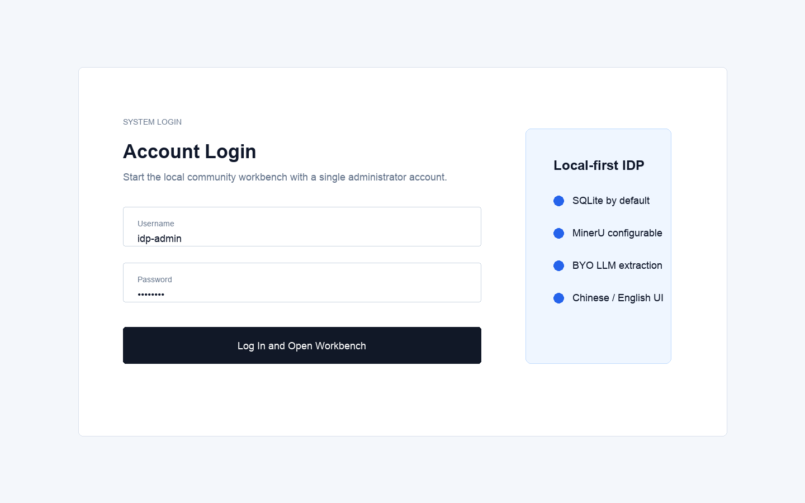
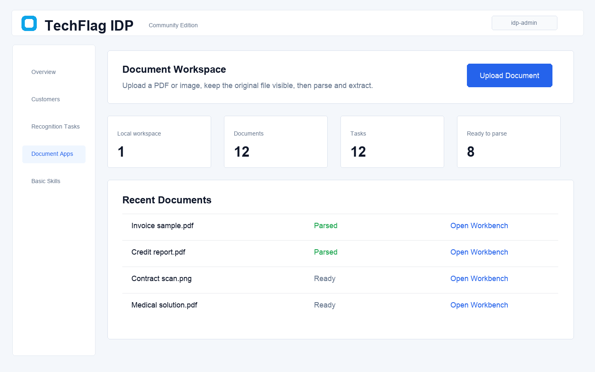
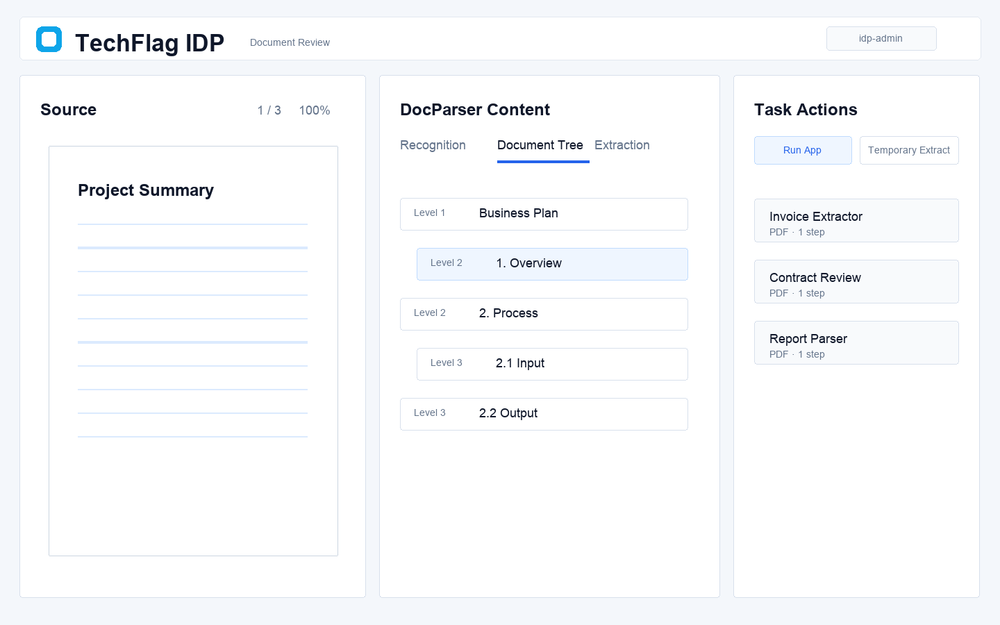
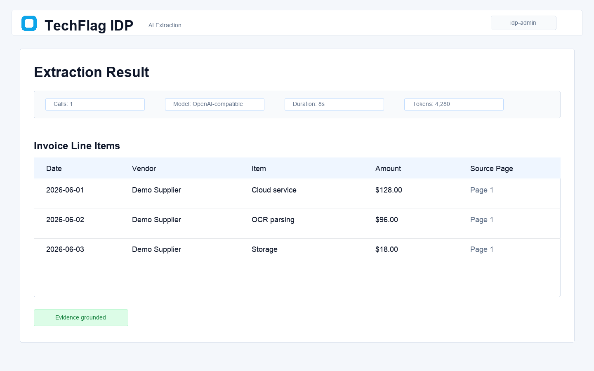

# TechFlag IDP Community Edition

[中文 README](README.zh-CN.md) · [User Manual](docs/user-manual.md) · [中文使用手册](docs/user-manual.zh-CN.md) · [Gitee Mirror](https://gitee.com/techflag/idp)

TechFlag IDP is a local-first intelligent document processing workbench. It helps developers and document-AI builders upload documents, parse layouts, inspect document trees, run evidence-grounded extraction, and turn repeatable extraction logic into basic reusable workflows.

The community edition is designed for local startup, source-code reading, and basic workflow evaluation with bring-your-own providers.

## Highlights

- Local community setup with default `IDP_EDITION=community`.
- SQLite by default, so no database server is required for the first run.
- Local object storage by default; OSS can be configured when public file URLs are needed.
- MinerU is the default OCR and document parsing engine.
- OpenAI-compatible LLM provider for real AI extraction.
- Single-page/basic document workflow suitable for learning, evaluation, and extension.
- Chinese and English frontend UI.

Apply for a MinerU token here:

```text
https://mineru.net/?source=github
```

## Screenshots

| Login | Workspace Upload |
|---|---|
|  |  |

| Document Review | AI Extraction Result |
|---|---|
|  |  |

## Clone

GitHub:

```bash
git clone https://github.com/techflag/idp.git
cd idp
```

Gitee:

```bash
git clone https://gitee.com/techflag/idp.git
cd idp
```

## First Run

### Requirements

Recommended versions:

- Python 3.10+
- Node.js 18+
- npm 9+

### Start Backend

```bash
cd backend
python3 -m venv .venv
source .venv/bin/activate
python -m pip install -U pip
python -m pip install -r requirements.txt
cp .env.local.example .env.local
alembic -c alembic.ini upgrade head
python scripts/diagnose_auth.py --ensure-admin --password demo-pass
./start.sh
```

Backend health check:

```text
http://127.0.0.1:5006/api/health
```

Default local admin account:

```text
Username: idp-admin
Password: demo-pass
```

Stop the backend:

```bash
cd backend
./stop.sh
```

### Start Frontend

Open another terminal:

```bash
cd frontend
npm ci
npm run dev -- --host 0.0.0.0
```

Open:

```text
http://127.0.0.1:5173/idp/
```

After login, use the default local workspace named `场景应用` to upload documents and try the basic community workflow.

## Database

The community edition needs a database, but the default local setup does not require a separate database server.

The backend uses SQLite by default:

```text
backend/.runtime/idp-community.db
```

This file is created locally after database migration and is not committed to Git.

The startup command below creates or upgrades local tables:

```bash
cd backend
alembic -c alembic.ini upgrade head
```

`backend/start.sh` also runs this migration automatically by default. If you start the backend manually with `python -m app.main`, run the Alembic command first.

If login fails with `sqlite3.OperationalError: no such table: users`, run:

```bash
cd backend
alembic -c alembic.ini upgrade head
python scripts/diagnose_auth.py --ensure-admin --password demo-pass
```

The second command creates or resets the local admin account and ensures the default `场景应用` workspace exists.

## Provider Configuration

Without provider keys, the community edition should still start, log in, and browse basic pages. Real document parsing and real AI extraction require provider configuration.

OSS is optional for local community use. If OSS credentials are not configured, uploaded files and generated assets are stored under:

```text
backend/.runtime/objects
```

Storage mode is controlled by `OBJECT_STORAGE_PROVIDER` in `backend/.env.local`:

- `auto`: use OSS when valid OSS credentials are configured, otherwise use local storage
- `local`: always use `backend/.runtime/objects`
- `oss`: require OSS credentials

The default OCR and document parsing engine is MinerU. For real document parsing, configure:

```bash
MINERU_TOKEN=your-mineru-token
```

MinerU cloud must be able to fetch the uploaded file URL. With default local storage, uploaded files are usually served as local backend URLs and cannot be fetched by the MinerU cloud service.

For real cloud parsing, use one of these options:

- Configure OSS so uploaded files get externally reachable object URLs.
- Or expose the backend through a public URL and configure:

```bash
BACKEND_PUBLIC_BASE_URL=https://your-public-backend.example.com
```

For real AI extraction, configure an OpenAI-compatible model:

```bash
DASHSCOPE_API_KEY=your-llm-key
DASHSCOPE_BASE_URL=https://dashscope.aliyuncs.com/compatible-mode/v1
DASHSCOPE_MODEL=qwen3.6-27b
```

When a required token or key is missing, the UI should show a configuration hint instead of entering a long pending state.

## Documentation

- [User Manual](docs/user-manual.md)
- [中文使用手册](docs/user-manual.zh-CN.md)
- [Edition Policy](docs/edition-policy.md)

## Checks

```bash
python3 scripts/check_edition_policy.py
python3 scripts/check_public_export.py /path/to/idp-community-export
```

Frontend build:

```bash
cd frontend
npm run build
```

## License

Apache License 2.0. See [LICENSE](LICENSE).
